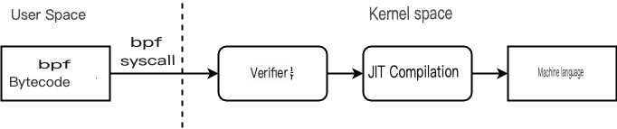

In LK06 (Brahman), we attack a bug in the JIT (verifier) in eBPF, one of the features of the Linux kernel. In this chapter, you will first learn about BPF and how to use it.

<div class="column" title="TOC">
<!-- toc --><br>
</div>

## BPF
Before describing the eBPF, let me explain its predecessor, the BPF.
BPF has been extended over time as its usage has expanded. BPF after the major change is called eBPF (extended BPF), and BPF before that is called cBPF (classic BPF). However, since only eBPF is used internally in the current Linux, eBPF/cBPF are collectively called BPF in this site when no clear distinction is necessary.

### What is BPF?
**BPF** (Berkeley Packet Filter) is a unique RISC-type virtual machine in Linux kernel. It is provided to execute code passed from user space in kernel space. Naturally, it is dangerous to execute arbitrary code, so most of the instruction sets in the BPF are safe instructions such as arithmetic operations and conditional branches. However, it also includes instructions such as memory writes and jumps whose safety cannot be guaranteed, so they are passed through the **verifier** when the bytecode is accepted. This ensures that only safe programs (e.g., those that do not fall into infinite loops) are executed.
So why do we need to go this far to execute code in kernel space from user space?
BPF was originally designed for packet filtering. If the user loads the BPF code, the BPF code is executed when a communication packet is generated and can be used for filtering. Nowadays, besides packet filtering, BPF is also used to obtain execution traces and to provide a mechanism for seccomp to filter system calls.

Thus, BPF is now used in various places such as packet filtering and seccomp. However, interpreting and emulating BPF bytecode every time is not fast enough. Therefore, the BPF bytecode that has passed through the verifier is converted into a machine language that can be interpreted by the CPU using a **JIT** (Just-in-Time) compiler.
A JIT compiler is a mechanism that dynamically converts some code to native machine language during program execution. For example, browsers such as Chrome and Firefox, when they find a JavaScript function that is called many times, they convert it to machine language and execute the machine language side from then on to speed up the program. However, the JIT compiler is enabled by default in the current Linux kernel.

To summarize, the flow of BPF code execution is as follows.

1. BPF bytecode is passed from user space to kernel space by bpf system call.
2. The verifier checks whether it is safe to execute the bytecode.
3. If the verification succeeds, the JIT compiler converts the bytecode to the CPU-compatible machine language.
4. When an event occurs, the JIT compiled machine language is called.

<center>
  
</center>

When an event occurs, an argument is passed depending on the type of BPF (event you want to check) you have registered. This argument is called the **context**, and the BPF processes the argument and finally returns a single return value. For example, in the case of seccomp, a structure containing the number of the system call to be called, the architecture type, etc. is passed to the BPF program as an argument. The BPF program (seccomp filter) decides whether the system call is allowed or not based on the system call number, and passes it to the kernel as a return value. Upon receiving this return value, the kernel can decide whether to allow, deny, or fail the system call.

<div class="balloon_l">
  <div class="faceicon"></div>
  <p class="says">
    The seccomp still uses cBPF, but it only uses eBPF inside the kernel, so it's converted to eBPF first. Then, seccomp has its own verification mechanism in addition to the BPF verifier.
  </p>
</div>

BPF also uses something called a **BPF map** to communicate between BPF programs and user space, and BPF allows you to create a map, an associative array of key-value pairs [^1], in kernel space. We'll look at this in more detail when we actually write the BPF program.

[^1]: You can set the type of the map, but in the case of `BPF_MAP_TYPE_ARRAY`, the key is just an array since it is an integer value that also sets the upper limit.

### BPF Architecture
Let's look at the structure of the BPF in more detail. cBPF had a 32-bit architecture, but eBPF has a 64-bit architecture with more registers to match recent architectures. Here we explain the architecture of eBPF.

#### Registers and Stack
The BPF program can use 512 bytes of stack. eBPF provides the following registers.

| BPF registers | Corresponding x64 registers |
|:-:|:-:|
| R0 | rax |
| R1 | rdi |
| R2 | rsi |
| R3 | rdx |
| R4 | rcx |
| R5 | r8 |
| R6 | rbx |
| R7 | r13 |
| R8 | r14 |
| R9 | r15 |
| R10 | rbp |

Registers other than `R10` can be treated as general-purpose registers in a BPF program, but there are a few registers that have special meanings.
First, the context (pointer) passed from the kernel side goes into `R1`, and the BPF program will usually process the contents of this context. For example, a socket filter can retrieve packet data from the context.
The `R0` register is then used as the return value of the BPF program. Therefore, you must always set a value in `R0` before exiting the BPF program (`BPF_EXIT_INSN`). The exit code has a meaning, for example, in the case of seccomp, it indicates whether system calls are allowed or denied.
Next, `R1` through `R5` are used as argument registers for calling functions in the kernel (helper functions described below) from BPF programs.
Finally, `R10` is the stack frame pointer and is read-only.

#### Instruction Set
BPF programs loaded by general users can use up to 4096 instructions [^2].

[^2]: For the root user, up to 1 million instructions can be loaded.

Since BPF is a RISC type architecture, all instructions are the same size. Each instruction is 64 bits and each bit has a meaning as follows.

| bit | name | meaning |
|:-:|:-:|:-:|
| 0-7 | `op` | Opcode |
| 8-11 | `dst_reg` | Destination Register |
| 12-15 | `src_reg` | Source Register |
| 16-31 | `off` | Offset |
| 32-63 | `imm` | Immediate |

In the opcode `op`, the first 4 bits represent the code, the next 1 bit represents the source, and the remaining 3 bits represent the class.
The class specifies the type of instruction (memory write, arithmetic operation, etc.). Source determines whether the source operand is a register or an immediate value. The code then specifies the specific instruction number in the class.

The BPF instruction set is described in [Linux kernel documentation](https://www.kernel.org/doc/html/latest/bpf/instruction-set.html).

#### Program Type
When we actually tried BPF in the previous example, we specified the type `BPF_PROG_TYPE_SOCKET_FILTER`. Thus, it is necessary to specify at load time what the BPF program is to be used for.
In cBPF, there were only two types: socket filters and system call filters. eBPF provides more than 20 types.

The list of types is defined in [uapi/linux/bpf.h](https://elixir.bootlin.com/linux/v5.18.10/source/include/uapi/linux/bpf.h#L922).

For example, `BPF_PROG_TYPE_SOCKET_FILTER` is a use of socket filter that can be used in cBPF as well; the return value of the BPF program allows operations such as dropping packets. This type of BPF program can be attached to a socket by calling the `setsockopt` system call with the `SO_ATTACH_BPF` option.
The [`__sk_buff` structure](https://elixir.bootlin.com/linux/v5.18.10/source/include/uapi/linux/bpf.h#L5543) is passed as context.

<div class="balloon_l">
  <div class="faceicon"></div>
  <p class="says">
    If you pass the Linux kernel's sk_buff structure as is, it will depend on the kernel version, so I've aligned the structure for BPF.
  </p>
</div>

#### Helper Functions
As explained briefly in the register section, there are functions that can be called from the BPF program. For example, in the case of the socket filter, [four functions are provided](https://elixir.bootlin.com/linux/v5.18.10/source/net/core/filter.c#L7637) in addition to the base helper functions.
```c
static const struct bpf_func_proto *
sk_filter_func_proto(enum bpf_func_id func_id, const struct bpf_prog *prog)
{
	switch (func_id) {
	case BPF_FUNC_skb_load_bytes:
		return &bpf_skb_load_bytes_proto;
	case BPF_FUNC_skb_load_bytes_relative:
		return &bpf_skb_load_bytes_relative_proto;
	case BPF_FUNC_get_socket_cookie:
		return &bpf_get_socket_cookie_proto;
	case BPF_FUNC_get_socket_uid:
		return &bpf_get_socket_uid_proto;
	case BPF_FUNC_perf_event_output:
		return &bpf_skb_event_output_proto;
	default:
		return bpf_sk_base_func_proto(func_id);
	}
}
```
The base helper functions include `map_lookup_elem` and `map_update_elem`, which handle BPF maps. Let's learn how to use each function in concrete terms while actually writing BPF programs.

## Using BPF
Now, let's actually use BPF (eBPF).

If you are testing on the LK06 machine, there is no problem, but if you are testing on your own machine, first make sure that BPF can be used from a general user. At the time of writing this article, BPF is not available for general users to prevent side-channel attacks such as Spectre. You can check if it is enabled from `/proc/sys/kernel/unprivileged_bpf_disabled`.

```
$ cat /proc/sys/kernel/unprivileged_bpf_disabled
2
```
If this value is 0, BPF can be used by users who do not have `CAP_SYS_ADMIN`. 1 or 2, temporarily set it to 0.

### Writing BPF programs
When writing complex codes such as packet filtering, you usually use a compiler such as [BCC](https://github.com/iovisor/bcc) and write them in a higher-level language such as C. In this case, since we are only going to use it lightly for the purpose of exploit, let's write BPF bytecode directly without using a compiler. Directly does not mean that the bytecode is written in hexadecimal. There are macros available for the C language that can be written in a form that is easy for humans to understand, just like assembly language.
First, download [bpf\_insn.h](distfiles/bpf_insn.h) in which this macro is defined and put it in the same folder as the C code for testing.

First, run the BPF program, which does nothing.
```c
#include <linux/bpf.h>
#include <stdint.h>
#include <stdio.h>
#include <stdlib.h>
#include <sys/socket.h>
#include <sys/syscall.h>
#include <sys/types.h>
#include <unistd.h>
#include "bpf_insn.h"

void fatal(const char *msg) {
  perror(msg);
  exit(1);
}

int bpf(int cmd, union bpf_attr *attrs) {
  return syscall(__NR_bpf, cmd, attrs, sizeof(*attrs));
}

int main() {
  char verifier_log[0x10000];

  /* Prepare BPF program */
  struct bpf_insn insns[] = {
    BPF_MOV64_IMM(BPF_REG_0, 4),
    BPF_EXIT_INSN(),
  };

  /* Set usage (filter sockets) */
  union bpf_attr prog_attr = {
    .prog_type = BPF_PROG_TYPE_SOCKET_FILTER,
    .insn_cnt = sizeof(insns) / sizeof(insns[0]),
    .insns = (uint64_t)insns,
    .license = (uint64_t)"GPL v2",
    .log_level = 2,
    .log_size = sizeof(verifier_log),
    .log_buf = (uint64_t)verifier_log
  };

  /* load BPF program */
  int progfd = bpf(BPF_PROG_LOAD, &prog_attr);
  if (progfd == -1) {
    fatal("bpf(BPF_PROG_LOAD)");
  }

  /* Create Socket */
  int socks[2];
  if (socketpair(AF_UNIX, SOCK_DGRAM, 0, socks))
    fatal("socketpair");
  if (setsockopt(socks[0], SOL_SOCKET, SO_ATTACH_BPF, &progfd, sizeof(int)))
    fatal("setsockopt");

  /* Using the socket (triggering the BPF program) */
  write(socks[1], "Hello", 5);

  char buf[0x10] = {};
  read(socks[0], buf, 0x10);
  printf("Received: %s\n", buf);

  return 0;
}
```
This code loads the BPF program (`BPF_PROG_TYPE_SOCKET_FILTER`) for the socket. Therefore, the last `write` triggers the BPF program to be executed.

The following part is the BPF program.
```c
  struct bpf_insn insns[] = {
    BPF_MOV64_IMM(BPF_REG_0, 4),
    BPF_EXIT_INSN(),
  };
```
In this example, R0 is assigned the immediate 64-bit value 4 and the program is terminated. If all went well, the output should read "Hell".
The R0 register is used as the return value of the BPF program. In this case, the reason why only 4 characters are received even though 5 characters were sent with `write` is that the BPF dropped the packet. In other words, the return value allows us to cut off the sent data. In fact, the `socket` manual says

> SO_ATTACH_FILTER (since Linux 2.2), SO_ATTACH_BPF (since Linux 3.19)
>
>    Attach a classic BPF (SO_ATTACH_FILTER) or an extended BPF (SO_ATTACH_BPF) program to the socket for use as a filter of incoming packets.  **A packet will be dropped if the filter program returns zero.  If the filter program returns a nonzero value which is less than the packet's data length, the packet will be truncated to the length returned.** If the value returned by the filter is greater than or equal to the packet's data length, the packet is allowed to proceed unmodified.

### Using the BPF Map
Now that we have verified that we can filter packets using BPF, let's try to use the BPF map.
Next, let's try to use the BPF map, which is always used in eBPF exploits. The BPF map is used to communicate between user space (where the BPF program is loaded) and the BPF program running in kernel space.
To create a BPF map, call the `bpf` system call with `BPF_MAP_CREATE`. The `bpf_attr` structure that is passed in specifies the type `BPF_MAP_TYPE_ARRAY`, the size of the array and the size of the keys and values. in the context of exploit, the keys are fixed as int type, since keys can be small.

```c
int map_create(int val_size, int max_entries) {
  union bpf_attr attr = {
    .map_type = BPF_MAP_TYPE_ARRAY,
    .key_size = sizeof(int),
    .value_size = val_size,
    .max_entries = max_entries
  };
  int mapfd = bpf(BPF_MAP_CREATE, &attr);
  if (mapfd == -1) fatal("bpf(BPF_MAP_CREATE)");
  return mapfd;
}
```
Update values in the array with `BPF_MAP_UPDATE_ELEM` and retrieve with `BPF_MAP_LOOKUP_ELEM`.
```c
int map_update(int mapfd, int key, void *pval) {
  union bpf_attr attr = {
    .map_fd = mapfd,
    .key = (uint64_t)&key,
    .value = (uint64_t)pval,
    .flags = BPF_ANY
  };
  int res = bpf(BPF_MAP_UPDATE_ELEM, &attr);
  if (res == -1) fatal("bpf(BPF_MAP_UPDATE_ELEM)");
  return res;
}

int map_lookup(int mapfd, int key, void *pval) {
  union bpf_attr attr = {
    .map_fd = mapfd,
    .key = (uint64_t)&key,
    .value = (uint64_t)pval,
    .flags = BPF_ANY
  };
  return bpf(BPF_MAP_LOOKUP_ELEM, &attr); // -1 if not found
}
```
Try the following program to see how it works. You will see that you can read and write (in user space) the values of the map.
```c
  unsigned long val;
  int mapfd = map_create(sizeof(val), 4);

  val = 0xdeadbeefcafebabe;
  map_update(mapfd, 1, &val);

  val = 0;
  map_lookup(mapfd, 1, &val);
  printf("0x%lx\n", val);
```

Now, let's try to manipulate the BPF map from the BPF program side.
```c
  /* Prepare BPF map */
  unsigned long val;
  int mapfd = map_create(sizeof(val), 4);

  val = 0xdeadbeefcafebabe;
  map_update(mapfd, 1, &val);

  /* BPF Program Preparation */
  struct bpf_insn insns[] = {
    BPF_ST_MEM(BPF_DW, BPF_REG_FP, -0x08, 1),      // key=1
    BPF_ST_MEM(BPF_DW, BPF_REG_FP, -0x10, 0x1337), // val=0x1337
    // arg1: mapfd
    BPF_LD_MAP_FD(BPF_REG_ARG1, mapfd),
    // arg2: key pointer
    BPF_MOV64_REG(BPF_REG_ARG2, BPF_REG_FP),
    BPF_ALU64_IMM(BPF_ADD, BPF_REG_ARG2, -8),
    // arg3: value pointer
    BPF_MOV64_REG(BPF_REG_ARG3, BPF_REG_2),
    BPF_ALU64_IMM(BPF_ADD, BPF_REG_ARG3, -8),
    // arg4: flags
    BPF_MOV64_IMM(BPF_REG_ARG4, 0),

    BPF_EMIT_CALL(BPF_FUNC_map_update_elem), // map_update_elem(mapfd, &k, &v)

    BPF_MOV64_IMM(BPF_REG_0, 0),
    BPF_EXIT_INSN(),
  };

...

  /* Using sockets (triggering BPF program) */
  map_lookup(mapfd, 1, &val);
  printf("val (before): 0x%lx\n", val);

  write(socks[1], "Hello", 5);

  map_lookup(mapfd, 1, &val);
  printf("val (after) : 0x%lx\n", val);
```
This BPF program uses the `map_update_elem` helper function to change the value of key 1 in the BPF map to 0x1337.
First, prepare the key and value in memory, since both key and value are passed as pointers to `map_update_elem`.
```c
    BPF_ST_MEM(BPF_DW, BPF_REG_FP, -0x08, 1),      // key=1
    BPF_ST_MEM(BPF_DW, BPF_REG_FP, -0x10, 0x1337), // val=0x1337
```
`BPF_REG_FP` is `R10`, which is the stack pointer. `BPF_ST_MEM`, written in familiar x86-64 assembly, is
```
mov dword [rsp-0x08], 1
mov dword [rsp-0x10], 0x1337
```
Next, prepare the arguments. The arguments are put in order from `BPF_REG_ARG1`, which is the register from `R1`.
The first argument of `map_update_elem` is the file descriptor of the BPF map. It can be assigned to the register using `BPF_LD_MAP_FD`.
```c
    // arg1: mapfd
    BPF_LD_MAP_FD(BPF_REG_ARG1, mapfd),
```
The second and third arguments are pointers to keys and values, respectively.
```c
    // arg2: key pointer
    BPF_MOV64_REG(BPF_REG_ARG2, BPF_REG_FP),
    BPF_ALU64_IMM(BPF_ADD, BPF_REG_ARG2, -8),
    // arg3: value pointer
    BPF_MOV64_REG(BPF_REG_ARG3, BPF_REG_2),
    BPF_ALU64_IMM(BPF_ADD, BPF_REG_ARG3, -8),
```
The fourth argument is a flag, which should be 0.
```
    // arg4: flags
    BPF_MOV64_IMM(BPF_REG_ARG4, 0),
```
Finally, helper functions can be called using `BPF_EMIT_CALL`.
```c
    BPF_EMIT_CALL(BPF_FUNC_map_update_elem), // map_update_elem(mapfd, &k, &v)
```
Execution shows that the value of key 1 in the BPF map changes before and after the `write` instruction fired by the BPF program.
```
$ ./a.out 
val (before): 0xdeadbeefcafebabe
val (after) : 0x1337
```

This concludes the basics of BPF. As you can see, BPF programming allows you to implement packet filters and other functions by making full use of BPF maps and helper functions.
In the next chapter, we will talk about the verifier, which is the most important BPF-related vulnerability.

---

<div class="column" title="Example">
  In this chapter, we have partially dropped packets from the BPF program; find out if you can do the following using the BPF program, and if so, write a BPF program. (Hint: look up helper functions such as <code>skb_load_bytes</code>.)<br>
  (1) If the string "evil" is included in the data to be sent, it is dropped.<br>
  (2) If the size of data to be sent is 4 bytes or more, the first 4 bytes are changed to "evil".
</div>
